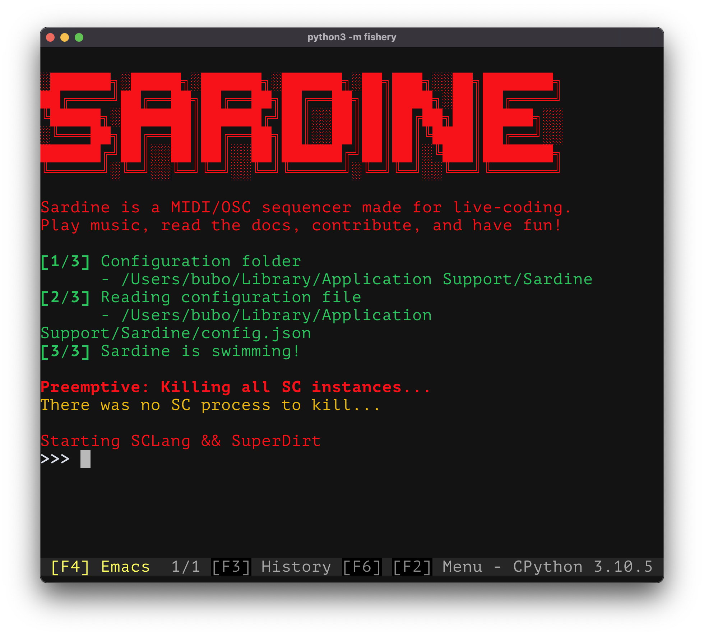
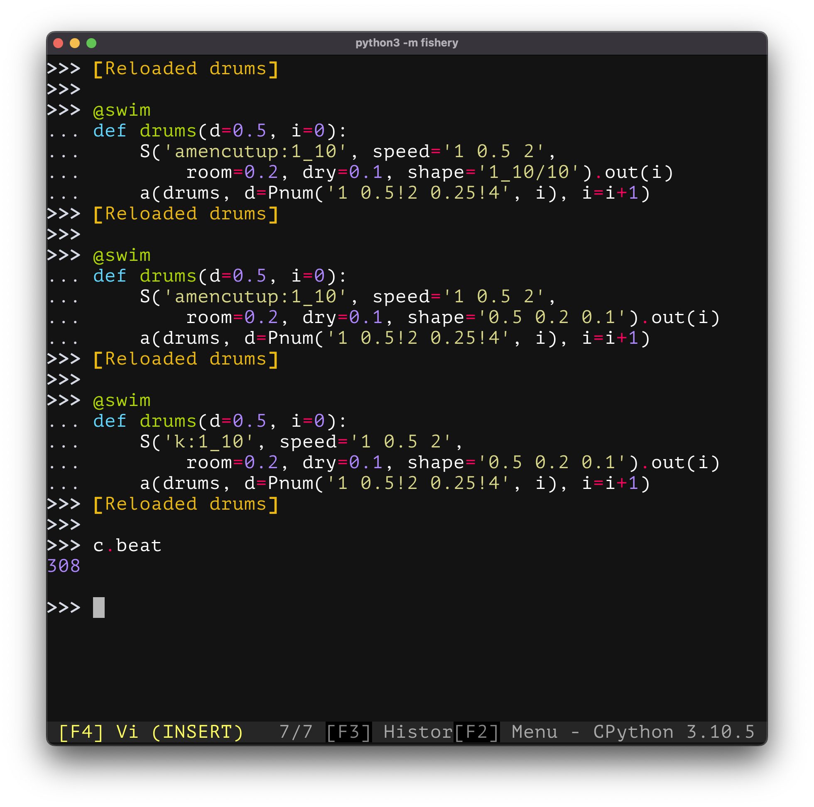

# Sardine: Python based live coding library with MIDI and OSC support ✨
[Discord Server](https://discord.gg/aPgV7mSFZh) | [Website](https://sardine.raphaelforment.fr) | [Sardinopedia](https://sardine.raphaelforment.fr/sardinopedia) | [About the author](https://raphaelforment.fr) | [About live coding](https://toplap.org/)

  @arnaldorusso

-----------

   <b>A big update of software and documentation is planned for November!</b> 
   <b>Sardine</b> has survived its first gigs! It is now being updated to improve on that new-acquired experience!

Sardine is a Python library tailored for musical live coding. **Sardine** can turn Python into a fun and fruitful music instrument or stage control tool for electronic musicians. It is based on the principle of [temporal recursion](http://extempore.moso.com.au/temporal_recursion.html). You can play music with **Sardine** and synchronize your other MIDI equipment or lock multiple computers on the same groove using the **Link** protocol. You can sequence synthesizers, samples, MIDI and OSC signals or even arbitrary Python code with a strict timing! Sardine is also able to piggy-back on the [SuperDirt](https://github.com/musikinformatik/SuperDirt) audio engine, a famous backend used by many live coders worldwide. 

## Contributions

There is no version number yet. We are still exploring what we created and you might see some things changing pretty quickly as a result. The first version, `0.0.1` is planned for release later this year. **Sardine** is looking for contributors! You can contact the **Sardine** community directly on **Discord** or MP me if you have specific questions.

### Contributing to documentation

The documentation lives in the `docs/` folder. It is simply a bunch a Markdown files. You can contribute by editing these files and adding the missing bit of information you would like to see being updated or added.

The code source lives in the `cli/` and `sardine/` folder. Most functions are already documented but the architecture of **Sardine** needs to be explained somewhere. You can contact me directly if you would like to learn more about it. There are no contributions rules for the moment, and I will explore each and every request that you would like to propose!

# Website

To learn more about Sardine, please consult the project website: [Sardine](https://sardine.raphaelforment.fr). It contains instructions for installation / configuration as well as tutorials to get started!

# Screenshots

