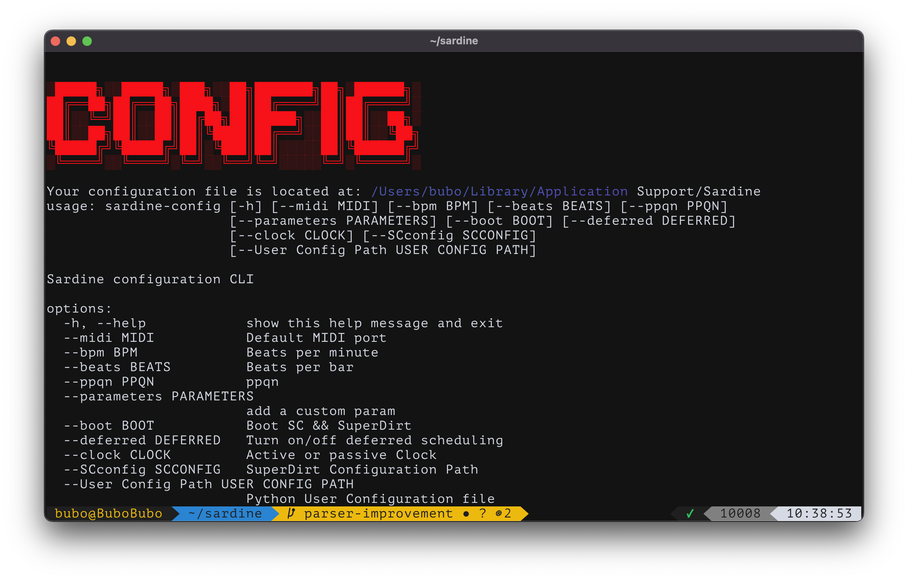

# Configuration

## How configuration works

When you boot Sardine for the first time, **Sardine** will create its own configuration folder and configuration files. The path will be printed everytime time you boot **Sardine** thereafter. There are three files you can tweak and configure:

- `config.json`: main **Sardine** configuration file.
- `default_superdirt.scd`: **SuperDirt** configuration file.
- `synths` folder: store new synthesizers written with **SuperCollider**.

There is another optional file that we will also describe:

- `user_configuration.py`: run Python code everytime you boot **Sardine**.

### Where are config files?

The location of the configuration folder is assumed to be the best possible default location based on your OS:

* **MacOS**: `Users/xxx/Library/Application\ Support/Sardine/`
* **Linux**: `.local/share/Sardine/` folder (???).
* **Windows**: `%appdata%/Sardine` (???).

## The configuration files

### Sardine config file

The `config.json` file will allow you to finetune **Sardine** by choosing a default MIDI port, a default PPQN and BPM, etc... You can edit it manually but you don't have too. There is a tool made for that, installed by default on your `$PATH`. Access it by typing `sardine-config`. **/!\\ Sardine must have booted at least once for it to work properly**.



You can use it as a regular command-line tool, by following instructions and feeding the right arguments. For instance, if you would like to change your default BPM to 140, write the following:

```bash
sardine-config --bpm 140
```

To select a default MIDI port without having to choose everytime you boot Sardine, enter something similar, matching the MIDI Port name with a port available on your computer:

```bash
sardine-config --midi "MIDI Bus 1"
```

### SuperDirt config file

The `default_superdirt.scd` is your default `SuperDirt` configuration. You must edit it manually if you are willing to load more audio samples, change your audio outputs or add anything that you need on the SuperCollider side. The `synths` folder is a repository for your `SynthDefs` file. Each synthesizer should be saved in its own file and will be loaded automatically at boot-time. The [SuperDirt](https://github.com/musikinformatik/SuperDirt) repository is a good place to start, especially the `hacks/` folder that will teach you how to edit and configure *SuperDirt* to your liking.

If you know how to work with text files from the terminal using `vim` or `nano`, there is a command available to open the default *SuperDirt* configuration file: `sardine-config-superdirt`. It will open up the file using `$EDITOR`. Be sure to configure it beforehand!

Here is an example of me adding more audio samples to play with:

```supercollider
(
s.reboot {
	s.options.numBuffers = 1024 * 256;
	s.options.memSize = 8192 * 32;
	s.options.numWireBufs = 128;
	s.options.maxNodes = 1024 * 32;
	s.options.numOutputBusChannels = 2;
	s.options.numInputBusChannels = 2;
	s.waitForBoot {
		~dirt = SuperDirt(2, s);
		~dirt.loadSoundFiles;
		~dirt.loadSoundFiles("/Users/bubo/Dropbox/MUSIQUE/LIVE_SMC/DRUMS/*");
		s.sync;
		~dirt.start(57120, 0 ! 12);
		(
			~d1 = ~dirt.orbits[0]; ~d2 = ~dirt.orbits[1]; ~d3 = ~dirt.orbits[2];
			~d4 = ~dirt.orbits[3]; ~d5 = ~dirt.orbits[4]; ~d6 = ~dirt.orbits[5];
			~d7 = ~dirt.orbits[6]; ~d8 = ~dirt.orbits[7]; ~d9 = ~dirt.orbits[8];
			~d10 = ~dirt.orbits[9]; ~d11 = ~dirt.orbits[10]; ~d12 = ~dirt.orbits[11];
		);
	};
	s.latency = 0.3;
};
)
```

Note that *SuperDirt* is *SuperDirt*. Some people already use this audio backend for live-coding, more specifically people working with [TidalCycles](https://tidalcycles.org). You will find a lot of configuration tips, tools and extensions by searching in the TOPLAP / Tidal communities forums and chats.

### User/Python config file

There is another file, `user_configuration.py` that is not created by default. It must be added manually if you wish to use this feature. All the code placed in this file will be imported by default everytime you boot **Sardine**. It is an incredibely useful feature to automate some things:

* functions, aliases, classes, **OSC** and **MIDI** connexions.
* Starting some musical code, aka 'art installation' mode for museums, openings, etc... You will be able to manually take over after init if you ever wished to change parameters.

Make sure not to override any of the defaults. This file will run **after** init, and can override basic Sardine functionalities if you are not careful enough.