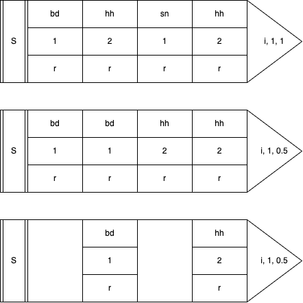

# Handler and Senders: Sardine environment

Sardine is a modular live-coding library. You can add and substract modular components to the system. Each component is responsible of one thing and one thing only such as sending MIDI notes or receiving incoming OSC messages. These components are referred to as `Handlers`. Among these handlers, some are specialised in sending messages and communicating with the outside world. These are called `Senders`. There is one piece of software holding everything together: the `FishBowl`. As you might expect from the name, a `FishBowl` is gathering all the components of the Sardine system.

## The FishBowl

The `FishBowl` is central to the **Sardine** system. It is composed of **hard** dependencies and **soft** dependencies. **Hard** dependencies are things like the **Clock** or the **Parser**. They are needed pretty much everywhere. As such, you can't really remove them or everything would fall apart. **Soft** dependencies are the various inputs or outputs you need to perform or to make anything meaningful with **Sardine**. By default, some of them will be added depending on what you have specified in your configuration file. This is just for convenience and to help newcomers.

### Hard dependencies

Core components cannot be removed from the `FishBowl`. However, they can be swapped! It means that you can all of the sudden rip off the current clock and switch to a new one. The system might hiccup a bit but it will recover! To do so, note that you can use two important methods: 

- `bowl.swap_clock(clock: "BaseClock")`: there are currently two clocks available: `InternalClock()` and `LinkClock()`. The latter is used for synchronisation with every device capable of using the `Link` protocol.

- `bowl.swap_parser(parser: "BaseParser")`: switch from a parser to another parser. There is no reason to do that because there is only one parser for the moment but it might be useful in the future.

### Soft dependencies

This is where the fun begins. Pretty much everything in the **Sardine** system is a modular component that can be added or removed. Take a look at the `run.py` file if you want to see how the system is first initialized. By default, Sardine is proposing a small collection of `Handlers` that will allow you to send or receive `MIDI`, `OSC` or `SuperDirt` messages. Some other `Handlers` are used for various internal functions that you might not care about. Take a look at the following code detailing how to add modular components:

```python
# Adding a MIDI Out handler: sending MIDI notes
# control changes, program changes, etc...
midi = MidiHandler(port_name=str(config.midi)) # new instance of the Handler
bowl.add_handler(midi) # adding the handler to the FishBowl

# OSC Loop: internal component used for handling OSC messages
osc_loop = OSCLoop() # new instance of the Handler
bowl.add_handler(osc_loop)  # adding the handler to the FishBowl

# OSC Handler: dummy OSC handler
dummy_osc = OSCHandler(
    ip="127.0.0.1",
    port=12345,
    name="My OSC sender",
    ahead_amount=0.0,
    loop=osc_loop,
)

# Aliasing some methods from the handlers for later :)
M = midi.send
CC = midi.send_control_changes
PC = midi.send_program_changes
O = dummy_osc.send
```

Please take note of the `bowl.add_handler` method. If you don't add your component to the `FishBowl`, your component will inevitably crash! This is a fairly common mistake, especially if you are working in a hurry. 

### Messaging system

You might wonder what the `FishBowl` is actually doing behind the scene. Factually, it allows component to talk with each other by sharing a reference to the `bowl`. It means that any component can send a message to any other component. It also means that this same component can promptly react to any event dispatched through the `FishBowl`. Internal messages are sent using the `bowl.dispatch(message_type: str, *args)` method. This is how messages such as `bowl.('pause')`, `bowl.('resume')`, `bowl.('stop')` and `bowl.('play')` are able to stop and resume everything when needed. They are messages dispatched to the `FishBowl` making everyone aware that a major event occured.

## Default senders: Where Music is Made

When you install **Sardine**, you also install a set of default **Senders** that will allow you to:

- **SuperDirt Sender**: play sounds/synths using **SuperCollider** and the **SuperDirt** engine.

- **MIDI Sender**: trigger/control MIDI capable software / hardware.

- **OSC Sender**: send or receive *Open Sound Control* messages.

Naturally, **Sardine** users are thinking about adding more and more senders. Some are planned, some have never seen the light, and the best ones will be surely be added to the base library in the future. For now, these three *I/O* tools cover most of the messages used by *live-coders* and *algoravers*. **Python** packages can be imported to deal with other things that **Sardine** is not yet covering. You can turn the software into an ASCII art patterner or hack your way around to deal with DMX-controlled lights. 

You will soon figure out that learning how to *swim* was kind of the big deal. The rest is much easier to learn because you will now play with code quite a lot! **Senders** and *swimming functions* are enough to already make pretty interesting music. The rest is just me sprinkling goodies all around :)

## I - Anatomy of Senders

A **Sender** is an *event generator*. It is a method call describing an event. This event can mutate based on multiple factors such as patterns, randomness, chance operations, clever **Python** string formatting, etc... A single sender call can be arbitrarily long depending on the precision you want to give to each event. It can sometimes happen that a sender will receive ten arguments or more.  

```
       /`-._                          /`-._
     _/,.._/                        _/,.._/
  ,-'   ,  `-:,.-')        _     ,-'   ,  `-:,.-')        _
 : S(...):';  _  {              : M(...):';  _  {               ... and more
  `-.  `' _,.-\`-.)        +     `-.  `' _,.-\`-.)        +
     `\\``\,.-'                     `\\``\,.-'
                               
```

### Args and kwargs arguments


Every sender (`D()`, `CC()`, `PC()`) is an object taking *arguments* and *keyword arguments*. **Arguments are mandatory**, and keyword arguments are optional. These arguments will help to define your event:

```python
D('bd', speed='[1:2,0.5]', legato=1, shape=0.5) # Heavy drumbass
N(note='<C@min7^1>', dur=2, channel=0)          # Short MIDI chord
```

You will have to learn what *arguments* each sender can receive. They all have their specialty. Despite the fact that they look and behave similarly, the event they describe is often different in nature. If you are interested in the default **SuperDirt** output, take a look at the **Reference** section in the menubar.

### Patterning the body

When using a **sender**, you usually describe a static event composed of multiple parameters. Live-coders tend to avoid using static events as they get repetitive very quickly. You will gradually seek ways to avoid strict repetition by varying some if not all of the parameters involved in a sender. The best way to bring some variation to a pattern is to rely on the pattern mechanisms allowing you to modify how your string keyword arguments are parsed:

- `iterator (i for short)` (*int*): the iterator for patterning. **Mandatory** for the two other arguments to work properly. This **iterator** is the index of the values extracted from your linear list-like patterns (your **arguments** and **keyword arguments**). How this index will be interpreted will depend on the next two arguments.

- `div` (*int*): **a timing divisor**, that can be aliased to `d`. It is very much alike a modulo operation. If `div=4`, the event will be emitted once every 4 iterations. The default is `div=1`, where every event is a hit! Be careful not to set a `div=1` on a very fast *swimming function* as it could result in catastrophic failure / horrible noises. There is no parachute out in the open sea.

- `rate` (*float*): a speed factor for iterating over pattern values. It can be aliased by `r`. It will slow down or speed up the iteration speed, the speed at which the pattern values are indexed on. For the pattern `1, 2, 3` and a rate of `0.5`, the result will be perceptually similar to `1, 1, 2, 2, 3, 3`.

It is quite tricky to understand, and I am not sure that all Sardine users are actually able to grasp what these arguments do. That's something you have to see represented differently. Take a look at the three arguments on the right in the following diagram. Note how different values will produce different iteration speeds:

{align=center}

Now, try exploring this idea using this dummy pattern:
```python
@swim
def ocean_periodicity(p=0.5, i=0):
    D('bd, hhh, sn, hhh', speed='1,2', freq='r*800', i=i, d=2, r=0.5)
    again(ocean_periodicity, p=0.5, i=i+1)
```
Don't touch to the pattern itself, just change `i`, `r` or `d`. Try to get more familiar with this system. You can change the recursion speed to notice more clearly how the pattern will evolve with time.

### Tips for writing Senders

Python is an *extremely* flexible and expressive programming language. It is actually a breeze to compose arguments and keyword arguments in very fun and creative ways. Let's take some examples of some things you might want to do in the future! You can for instance store parameters common to multiple messages in a list/dictionary before sticking them to your patterns using the `*` and `**` idiom:

```python
params = {'loud': {'amp': 2, 'shape': 0.9}, 'soft': {'amp': 0.1, 'legato': 0.1}}
D('bd', **params['loud'])
```

## II - The Dirt Sender (D)

The **Dirt** or **SuperDirt** sender is a sender specialised in talking with **SuperCollider** and more specifically with **SuperDirt**, a great sound engine made for live-coding. This piece of software was initially written by [Julian Rohrhuber](https://www.rsh-duesseldorf.de/en/institutes/institute-for-music-and-media/faculty/rohrhuber-julian/) for TidalCycles but many people also use it as is. It is very stable, very flexible and highly-configurable. 

This sender is the most complex you will have to interact with and it is entirely optional if you wish to use **Sardine** only to sequence MIDI and OSC messages. This sender is actually not so different from a specialised OSC sender that talks exclusively with **SuperDirt** using special timestamped messages. The sender is always used like so:

```python
D('sound', keyword=value_or_pattern, keyword2=value_or_pattern, i=iterator, d=div, r=rate)
```

The first argument defines the sound or synthesizer you want to trigger and it is **not optional**. Without it, you can be sure that the sender will crash because it cannot apply parameters to a sound that is undefined. The keyword parameters are the names of your **SuperDirt** parameters. It can be standard parameters, orbit parameters (audio bus) or parameters related to the synthesizer you are using. You will find more about this in the Reference section that is listing pretty much all of them! It takes some experience to know what meaningful parameters are but you will get it after practicing for a while! You will feel a bit lost at first but this is a case where you learn a lot by experimenting. Take a look at the following examples.

### Simple Bassdrum

```python3
@swim
def bd(p=0.5):
    D('bd')
    again(bd, p=0.5)
```
A simple bassdrum playing on every half-beat. This is the most basic sound-making function you can write.

### Complex Bassdrum

```python3
@swim
def bd(p=0.5):
    D('bd', speed='r*4', legato='r', cutoff='100+0~4000')
    again(bd, p=0.25)
```
A simple bassdrum but some parameters have been tweaked to add some randomness to the result. See how patterns can be used to make your keyword arguments more dynamic. The additional parameters are :

- `speed` will reverse (<0), slow (0-1), or accelerate the sample (>1) by altering the playback speed. The `r` token provides randomization between `0.0` and `1.0` (*float*).
- `legato` defines the maximum duration of the sample before cutting it, here randomized in the `0` to `1` range.
- `cutoff` will attenuate some frequencies. This is the cutoff frequency of a lowpass filter that shuts down frequencies higher to the frequency cutoff. The cutoff frequency is guaranteed to be at least `100` plus a certain amount between `0` and `4000`.

### Simple Breakbeat

```python3
@swim
def bd(p=0.5, i=0):
    D('amencutup:0~20', i=i)
    again(bd, p=0.25, i=i+1)
```
Picking a random sample in a folder containing slices of the classic [amen break](https://en.wikipedia.org/wiki/Amen_break). You could have a successful career doing this in front of audiences. Once again, the *magic* happens with the `sample:r*X` notation, which randomizes which sample is read on each execution, making it unpredictable. Note the use of an iterator. Without it, you would actually play the first sample again and again.

### Sample sequencing

```python3
@swim
def bd(p=0.5, i=0):
    D('bd,hh,sn,hh', i=i)
    again(bd, p=0.5, i=i+1)
```
Your classic four-on-the-floor. 

### Piling up / Polyphony

```python3
@swim
def pluck(p=0.5, i=0):
    D('pluck')
    D('pluck:1')
    D('pluck:2').out(i)
    D('pluck:3').out(i)
    again(pluck, p=0.5, i=i+1)
```

You can stack events easily by just calling `D()` multiple times. In the above example, it happens that `pluck` samples are nicely order and are generating a chord if you struck them at the same time. How cool! But wait, there is more to it:

```python3
@swim
def pluck(p=0.5, i=0):
    D('<pluck:[0:4]>', octave=6)
    again(pluck, p=0.5, i=i+1)
```

You can also stack sounds by using polyphony. With **Sardine**, polyphony is not a concept reserved to notes. Every pattern can be polyphonic (sample names, speeds, adresses, etc...).

## II - MIDI Senders

MIDI is supported by the default `MidiHandler`. This handler is a bit special because it is defining multiple ways to send out MIDI information and not just notes or whatever. Every MIDI message can theorically be supported but the most important only are defined as of now. Send me a message if you would like to see support for other messages. This default MIDI sender works by defining a bunch of different `send` methods: 

- `midi.send`: sending MIDI notes. Aliased as `N()` in the default setup.

- `midi.send_control`: sending control changes (CC Messages), aliased as `CC()` in the default setup.

- `midi.send_program`: sending program changes, aliased as `PC()` in the default setup.

### Note Sender

The **Note** or **N** sender is a sender specialised for emitting **MIDI** *note-on* and *note-off* messages just like on a music tracker or DAW. It does not have a lot of arguments, and if you have some degree of familiarity with the **MIDI** protocol, you will feel at home pretty quickly:

- **note** (argument): your note number, between `0` and `127`. You can of course use patterns, and patterns can be patterns of notes (special syntax for writing chords, scales, notes, etc...). Values are clamped. If you enter an incredibly big number, it will be clamped to `127`. The same thing goes for small or negative numbers that will be brought back to `0`.

- **channel** or **chan**: your **MIDI** channel from `0` to `15` (`1` to `16` in human parlance).

- **velocity** or **vel**: amplitude of your note, between `0` and `127`.

- **duration** or **dur**: duration of your note. Time between the *note-on* and *note-off* messages. This time is calculated in seconds. `dur=0.4` means that your note will be a little bit less than half a second.

## Control change and Program Change Sender

Study the preceding example. The Control Change and Program Change senders are rather similar. They only take some other keyword arguments to properly function:

- `control` (between `0` and `127`): the MIDI control number you would like to target.
- `value` (between `0` and `127`): the MIDI value for that control.
- `program` (between `0` and `127`): the MIDI program to select.

### Sending a note

```python3
@swim
def midi(p=0.5, i=0):
    N().out()
    again(midi, p=0.5, i=i+1)
```
No argument required to send a **MIDI** Note (`60`) at full velocity (`127`) on the first default **MIDI** channel. Arguments are only used to specify further or to override default values.

### Playing a tune

```python3
@swim
def midi(p=0.5, i=0):
    N(note='C5,D5,E5,G5,E5,D5,G5,C5', i=i)
    again(midi, p=0.5, i=i+1)
```
Playing a little melody by tweaking the `note` argument.

### A bit better

```python3
@swim
def midi(p=0.5, i=0):
    N(chan='0,1,2,3',
      vel='20 + (r*80)',
      dur=0.4, i=i,
      note='C5,D5,E5,G5,E5,D5,G5,C5')
    again(midi, p=0.5, i=i+1)
```
The same melody spreaded out on three **MIDI** channels (one per note) with random velocity.

### Other messages

```python3
@swim
def midi(p=0.5, i=0):
    D(channel='0,1,2,3',
      velocity='20 + (r*80)',
      dur=0.4, i=i,
      note='C5,D5,E5,G5,E5,D5,G5,C5')
    PC(program='1,2,3,4', i=i)
    CC(chan=0, control=20, val=50, i=i)
    again(midi, p=0.5, i=i+1)
```
Switching between program `1`, `2`, `3` and `4` on your MIDI Synth. Sending a control change on channel `0`, number `20` for a value of `50`.

## III - OSC Sender

The **OSC** Sender is the most complex and generic of all. It is a **sender** specialised for the *Open Sound Control* protocol. It is not complex because there are a lot of arguments and keyword arguments to learn but because using it relies on instanciating the **sender** and adding it to the bowl before being able to do anything:

```python
output_one = OSCHandler(
    ip="127.0.0.1", port=12345,
    name="A first test connexion",
    ahead_amount=0.0, loop=osc_loop, # The default OSC loop, don't ask why! 
)
bowl.add_handler(output_one)

output_two = OSCHandler(
    ip="127.0.0.1", port=12346,
    name="A second test connexion",
    ahead_amount=0.0, loop=osc_loop,
)
bowl.add_handler(output_two)

# Look who's here, the send functions as usual
one = output_one.send
two = output_two.send
```

You can now use the methods `one` and `two` as OSC senders just like `D()` or `N()`.  

```python
@swim
def one_two_test(p=0.5, i=0):
    """This is a dummy swimming function sending OSC."""
    one('random/address', value='1,2,3')
    again(one_two_test, p=0.5, i=i+1)
```

If you'd like, you can also make a **Player** (see *surfboards* in the preceding section) out of it by using the following technique:

```python
def osc_player(*args, **kwargs):
    """Partial function to add a new OSC player :)"""
    return play(
        output_one, 
        output_one.send, 
        *args, **kwargs
    )

Pa >> osc_player('random/address', value='1,2,3')
```

### Receiving OSC

You can also receive and track incoming OSC values. In fact, you can even attach callbacks to incoming OSC messages and turn **Sardine** into a soundbox so let's do it!

```python
# Making a new OSC-In Handler
listener = OSCInHandler(
    ip="127.0.0.1", 
    port=44444, 
    name="Listener", 
    loop=osc_loop
)

# Adding the listener to the bowl
bowl.add_handler(listener)

def funny_sound():
    D('bip', shape=0.9, room=0.9)

listener.attach('/bip/', funny_sound)
```

That's everything you need! In the above example, we are declaring a new `OSCInHandler` object that maps to a given port on the given IP address (with `127.0.0.1` being `localhost`). All we have to do next is to map a function to every message being received at that address and poof. We now have a working soundbox. Let's break this down and take a look at all the features you can do when receiving OSC.

There are three methods you can call on your `OSCInHandler` object:

- `.attach(address: str, function: Callable, watch: bool)` : attach a callback to a given address. It must be a function. Additionally, you can set `watch` to `True` (`False` by default) to also run the `.watch` method automatically afterhands.

- `.watch(address: str)` : give an address. The object will track the last received value on that address. If nothing has been received yet, it will return `None` instead of crashing \o/.

- `.get(address)` : retrieve the last received value to that address. You must have used `.watch()` before to register this address to be watched. Otherwise, you will get nothing.

### Blending OSC

If you are receiving something, you can now use it in your patterns to map a captor, a sensor or a controller to a **Sardine** pattern. If you combo this with [amphibian-variables](#amphibian-variables), you can now contaminate your patterns with values coming from your incoming data:

```python
listener.watch('/sitar/speed/')

@swim 
def contamination(p=0.5, i=0):
    v.a = listener.get('/sitar/speed/')['args'][0]
    D('sitar', speed='v.a')
    again(contamination, p=0.5, i=i+1)
```

This opens up the way for environmental reactive patterns that can be modified on-the-fly and that will blend code and human interaction. Handling data received from **OSC** can be a bit tricky at first:

- if you wish to carefully take care of the data you receive, please use the `.attach()` method to attach a callback to every message received and properly handle the data yourself. Use the form `callback(*args, **kwargs)` and examine what data you receive in the *args* and *kwargs*. Map this to global variables, etc...

- if you don't care and just want to watch values as they go, please use the `.watch()` value but you will have to resort to using dictionnary  key access just like I do in the example above. You will have to handle cases where no data is received or cases where the received value is not of the right type. There is no memory of old messages, only the most recent one is kept in memory!

This is not ideal for some of you who do a lot of things with **OSC**. Please provide suggestions, open issues, etc... We will sort this out together!
