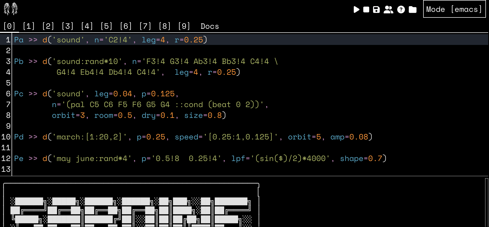

# Fishery Web

You don't need a text editor to play with **Sardine**.
Just start **Sardine** with its own text editor by typing 
`fishery web`. You can optionally the `--port` and  `--host` 
arguments for fine-tuning your local server:

    fishery web
    fishery web --port 12345
    fishery web --host 0.0.0.0 --port 8000

Your web browser will open as a result of typing the command. 
Our text editor is a web application living in your web browser,
generally at `https://localhost:8000`. The text editor is simple
but has a few nice features:

- multi-pane / multi-buffer editing.
- access to the Sardine documentation.
- normal editing mode or [Vim](https://en.wikipedia.org/wiki/Vim_(text_editor)) mode.
- quick access to play/pause, etc&#x2026;
- console for logging.
- **Shift + enter** to eval code 
  - **note:** you need to select code before running it)

The text editor also handles its own set of text files automatically.
You can retrieve them inside the **Sardine** folder (see the appropriate section).

## Building the web application yourself

For now, the application must be built manually in able to be used. In the `/fishery/client` directory, 
run `yarn install` and `yarn run build` to build the text editor. As you might guess, you need to 
install [Yarn](https://yarnpkg.com/) and also [npm](https://www.npmjs.com/). These are tools used by
Javascript developers to build their applications. These commands should only be runned once everytime 
you install **Sardine**.
