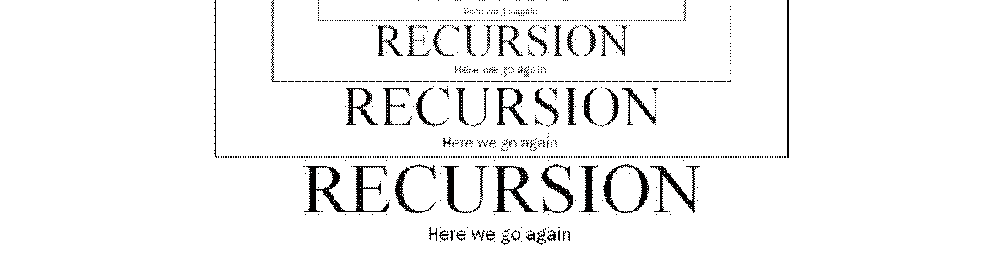

---
hide:
    - navigation
---

!!! danger "The tutorial is not up to date"

    Sardine was updated quite a lot recently. The tutorial has not been fully updated to reflect changes. Please rely on the *Sardinopedia* for now, until I fix this long-form article :)

At last! You have now installed and configured Sardine. You are up and running but you still don't know how to use **Sardine**! You might not really understand what it is either. This tutorial will hopefully help you to understand what **Sardine** is and what it does. I will not dive deep into technical details but this will serve as an in-depth exploration of the different components of **Sardine**.

## Practical Philosophy


*This is Epictetus, no links with Sardine but he was teaching practical philosophy too...*

### What you can do

 To be clear once and for all, **Sardine** is:

- strictly speaking, a music *live coding* library (*eg.* TidalCycles, FoxDot, Gibber)

but more trivially, it is:

- a musical instrument that you gradually learn to master and to tune to your liking

- a control tool for external audio/video devices, instruments and softwares

- an environment for improvising algorithmic music live by coding with Python

- a blank canevas for exploring musical ideas (rhythms, textures and pitch) on-the-fly


On the contrary, **Sardine** is not (or not *really*):

- a **Digital Audio Workstation**: no timeline, no click and play process, no ready-to-use patterns or presets, no way to save and recall sessions with pre-configured parameters, no way to record, process and master songs, tracks or beats. **Sardine** is meant to be used in **parallel** with such tools :)

- a compositional environment to write scores or to deal programatically with traditional score notation (*à la* **Finale**, **Sibelius**, **Lilypond**, etc...). **Sardine** is not meant for *writing*, but for *playing*. This would be the same thing as to ask a piano to print a musical score while you play.

This doesn't mean that you can't compose things with **Sardine** to play them later. It just means that it doesn't deal with the traditional scoring system. If your intent is to prepare for an art installation, a techno/house gig or an experimental music recital, you can do it just fine!

### How you do it

**Sardine** is an instrument/tool that you control by programming live. Your keyboard will be your main musical interface, which is pretty unusual compared to other musical practices. **Sardine** is a tool made to explore various *live coding* techniques, and a tool made to integrate with other live coding softwares and environments. For people unfamiliar with it, *live coding* could be said to be three distinct things:

- a **programming technique**: the art of manipulating, redefining or altering software while it runs. A technique exploring processes of *hot swapping*, *reloading* or *re-compiling* parts of a software stack without interruption, as part of the way the software is meant to be used.

- an **artistic practice**: promoting artistic expression throughout the use of computer code. Turning programming into a gestural and expressive act, usually meant to be shared with an audience.

- a **subculture**: a niche in the larger world of computer and electronic music. *Live coding* has always been there. You can trace its origins way back to the 70s if you are really looking for it :) Nowadays, *live coding* is mostly promoted by *algoravers* or by the **TOPLAP** collective.

Try to read about it. It's a fascinating world of people happily *hacking* and sharing software, usually free and open source. The goal is to find the right tool for the nail you want to hammer, and build from there, turning your computer into an environment for personal artistic expression. For our case, it means that **Sardine** is meant to be extended, modified, specialised for what you need to do :)

## Sardine Clock

### MIDI Clock

The most crucial information to know about **Sardine** is that everything happens because of the **clock**. When **Sardine** is imported using the command `from sardine import *`, an instance of the `Clock` class will automatically start to run in the background and will be referenced by the variable `c`. `Clock` is the main MIDI Clock. By default, if you haven't touched to the configuration, the clock will be running in `active` mode: it will send a **MIDI** clock signal for every tick on the default MIDI port. The default MIDI port will either be a virtual port named `Sardine` if your OS supports virtual MIDI ports or the first available MIDI Port declared by your OS. It can also be `passive` and made to listen to the default MIDI port if you prefer. Never override the `c` variable. You won't have to worry a lot about the internals. Never override any variable that is one letter long! You will likely find the following commands interesting:

* `c.bpm`: current tempo in beats per minute.
* `c.ppqn`: current [PPQN](https://en.wikipedia.org/wiki/Pulses_per_quarter_note) (Pulses per Quarter Note, used by MIDI gear).
  - be careful. The tempo might fluctuate based on the PPQN you choose. Assume that 24 is a default sane PPQN for most synthesizers/drum machines.
* `c.accel`: an acceleration factor for the clock, from `0` to `100` (double tempo) %. 
* `c.nudge`: nudge the clock forward in time by the given amount. Usually pinged randomly until you fall back on the external click track you wish to follow. 

### Ableton Link Clock

The **Link** protocol is a novel open source protocol released by **Ableton** which allows users to synchronise their musical tempo seamlessly on a local network. While still pretty new, this method of synchronisation is now supported by a fair amount of by music software and apps, including other live coding libraries.

**Sardine** can be made to start or follow an **Ableton Link** Clock that will be shared by all users on the local network. To do so, you will need to join/start a session using the `c.link()` method. Be mindful that the regular behavior of the clock will be altered and that you won't be able to change the tempo or alter time the way you want. **Link** is a collaborative clocking protocol, and there is no "main" tempo originating somewhere and followed by everyone, unlike MIDI. To resume the regular behavior of the clock, use the command `c.unlink()`. The `c.link_log()` function can be used to monitor the **Ableton Link** Clock state. 


!!! info "Weirdness of Link Clock"

    The **Link Clock** is a bit weird. It will disrupt the regular behavior of the **Sardine** Clock. It will stop emitting a MIDI clock signal because it cannot ensure that the clock signal will be steady. **MIDI** Clocks and **Link Clock** does not go hand in hand. It is preferable to kill every running pattern before attempting the switch from regular time to Link time.

### Latency and sync

There are many possible reasons that could explain why your computer is not perfectly in sync with another one. To tackle this issue, **Sardine** is proposing a set of variables you can play with to finetune the latency of various parts of the system. If you ever encounter a synchronisation issue, try to play an event on the first beat of the bar on each computer and to play around with the following values:

- `c.midi_nudge`: in miliseconds. Nudge value for the MIDI Sender (MIDI).

- `c.superdirt_nudge`: in milliseconds. Nudge value for the SuperDirt Sender (Sound).

- `c.nudge`: in milliseconds. General nudge for the **Sardine** clock.

There is also an additional nudge value you can configure directly in your **SuperDirt** configuration. Finding the right configuration is usually just a matter of exploring and finding the right values for you and the other computer you are trying to synchronise with. Be careful not to override hard limits. Your computer needs some time to process information.

### More info about clocks

- Sardine will not behave nicely if no external clock is running while in `passive` mode. Time is simply frozen and events will not trigger, suspended somewhere in time.

- You can introspect the current state of the clock using clock attributes or using the very verbose `debug` mode. Be careful, your terminal will be flooded by messages. After running `c.debug = True`, you should see something that looks like:

```python
...
BPM: 130.0, PHASE: 15, DELTA: 0.001726 || TICK: 495 BAR:2 3/4
BPM: 130.0, PHASE: 16, DELTA: 0.001729 || TICK: 496 BAR:2 3/4
BPM: 130.0, PHASE: 17, DELTA: 0.001475 || TICK: 497 BAR:2 3/4
BPM: 130.0, PHASE: 18, DELTA: 0.000634 || TICK: 498 BAR:2 3/4
BPM: 130.0, PHASE: 19, DELTA: 0.000614 || TICK: 499 BAR:2 3/4
BPM: 130.0, PHASE: 20, DELTA: 0.001333 || TICK: 500 BAR:2 3/4
...
```

- Some interesting clock attributes can be accessed:
    * `c.beat`: current clock beat since start.
    * `c.tick`: current clock tick since start.
    * `c.bar`: current clock bar since start (`4/4` bars by default).
    * `c.phase`: current phase.

These clock attributes are used everywhere in **Sardine** as they provide the most basic interface to the clock for every component in the system. You can use them if you wish to compose more complex pieces and sequences. They are still really useful tools to craft conditionals and random number generators even though there are better and more controlled ways to access them (for instance, *via* the *patterning system*).

#### The meaning of sleep

If you are already familiar with *Python*, you might have heard about or used the `sleep()` function. This function will halt the execution of a program for a given amount of time and resume immediately after. **Sardine** does not rely on Python's `sleep` because it is *unreliable* for musical purposes! Your OS can decide to introduce micro-delays, to resume the execution too late or even not sleep for the precise duration you wanted. 

**Sardine** proposes an alternative to regular Python `sleep`, backed by the clock system previously described, crafted by @thegamecracks. The `sleep()` function has been overriden to allow you to have a safe and sane, similarly working alternative for musical contexts. You can use it to stop and resume a **swimming function** while keeping synchronization and timing accuracy.

```python
@swim
def sleeping_demo(d=1):
    print("Doing something...")
    sleep(1)
    print("Doing something else...")
    sleep(1)
    again(sleeping_demo, d=2)

@swim
def limping(d=4):
    S('hh').out()
    sleep(3)
    S('bd').out()
    again(limping, d=4)
```

The **swimming function** `sleeping_demo()` will recurse after a delay of `2`. Think of the time you have in-between a recursion as spare time you can use and consume using `sleep()`. You can use that time sending the instructions that compose your swimming function. You can also do nothing for most of your time just like in `limping()`. You can write code in an imperative fashion, something that you might have already encountered in live coding systems such as [Sonic Pi](https://sonic-pi.net/) or **SuperCollider** `Tdefs`.

!!! warning "Oversleeping is a thing"

    **Be careful**! You can oversleep and trigger a recursion while your function is still running, effectively overlapping different versions of your **swimming functions**:   

    ```python
    @swim
    def oversleep(d=4):
        S('hh').out()
        sleep(3)
        S('bd').out()
        again(oversleep, d=0.5) # Changed the value to oversleep
    ```

If you are not yet familiar with the concept of recursion, or with the meaning of some of the facts presented here, keep patience. The meaning of all this will become clear after a few sections and some tests on your side :)


#### Swimming functions

&nbsp;
&nbsp;
&nbsp;

{width=100%}
*To understand recursion, you must understand recursion says the old and not so funny joke...*

We have already used the term **swimming function** in the sections above without taking enough time to explain what it means precisely! In **Sardine** parlance, a **swimming function** is a function that is scheduled to be repeated by recursion. The function will call itself when it ends, and again and again. Usually, in computer science manuals, you learn that recursion always needs to end, that there must be a case where the function will exit. We have this in **Sardine** too but we usually want the function to continue indefinitely, as a way to generate rhythms and to build a musical groove.

A **swimming function** will call itself, and again, and again... This is a way computer scientists and **sardinists** alike like to think about loops and structures like lists. To define a function as a **swimming function**, use the `@swim` decorator. The opposite of the `@swim` decorator is the `@die` decorator that will release a function from this dreadful recursive temporal loop.

```python
@swim # replace me by 'die'
def bd(d=1):
    """Loud bassdrum"""
    S('bd', amp=2).out()
    again(bd, d=1) # again == anew == cs
```

If you don't manually add the recursion to the designated **swimming function**, the function will run once and stop. Recursion must be explicit and you should not forget about it! Forgetting the recursion loop call is another way to make a **swimming function** stop but not the recommended one!

```python
# Boring
@swim 
def bd(d=1):
    S('bd', amp=2).out()
```

The recursion can (and should) be used to update your arguments between each call of the **swimming function**. Here is an example of a very simple iterator:

```python
@swim # or die 
async def iter(d=1, nb=0):
    """A simple recursive iterator"""
    print(f"{nb}")
    again(iter, d=1, nb=nb+1)
# 0
# 1
# 2
# 3
# 4
```

This is an incredibly useful feature to keep track of state between each call of your function. **Swimming functions** and its handling of arguments are the most basic thing you have to learn in order to use **Sardine** proficiently. This is the base to improvise music with variation, nuance and finesse. Temporal recursion makes it very easy to manually code LFOs, musical sequences, randomisation, etc... It will gradually become like a second nature for you to write them.

**Swimming functions** are great but they have one **BIG** difference compared to a classic recursion: they are *temporal* recursive. They must be given a `delay` argument. The `delay` argument is actually `d` (shorter is better). If you don't provide it, Sardine will assume that your function uses `d=1`. If you forget it on one side while using it on the other side, **Sardine** will jump up to your neck and try to kill you. If you ever try to give a delay of `0`, your function will immediately stop and an error message will be printed in your terminal. Not waiting is simply not an option, otherwise we would equally be able to travel back in time :)

### Making sound / sending information

#### Sender objects

Sender objects are the most frequent objects you will be interacting with while playing with **Sardine**. Senders are objects that compose a single message that can be sent out using the `.out(iter=0)` method. They are your main interface to the outside world (*SuperCollider*/*SuperDirt*, *MIDI* or *OSC*). These objects can receive various and/or arbitrary parameters depending on their purpose and specialty. These arguments can be *integers* (`1`, `2`), *floats* (`1.23`, `0.123123`) or *strings* (`"baba"`, `"dada/43/baba/"`):

- *int*/*float*: parameters are sent as is, they are numbers!
- *string* : interpreted by **Sardine** and transformed into a pattern of values.

When you import **Sardine**, `MIDISender`, `SuperDirtSender` and `OSCSender` will already be available under the name `M()` (for **MIDI**),  `S()` (for **sound** or *SuperDirt*) and `O()` (for **OSC**). These objects are preconfigured objects that must be prefered to custom senders you can declare yourself (more on this later). `M`, `O` and `S` are three ways of interacting with the synthesis engine, your synths or other equipment/softwares.

#### SuperDirt output

The easiest way to trigger a sound with **Sardine** is to send an OSC message to **SuperDirt**. **SuperDirt** is designed as a tool that will convert control messages into the an appropriate action without having to deal with **SuperCollider** itself. Most people will use the **SuperDirt** output instead of plugging multiple synthesizers along with **Sardine**, or craft musical patches listening to OSC messages. The interface to **SuperDirt** is crude but fully functional. People already familiar with [**TidalCycles**](https://tidalcycles.org/) will feel at home using the `S()` (for `SuperDirt`) object. The syntax is extremely similar for the purpose is similar, and names often match between the two systems:  

```python
# A bassdrum (sample 0 from folder 'bd')
S('bd').out() 
# Fourth sample, way louder!
S('bd', n=3, amp=2).out() 
# Patterning a parameter (read the appropriate section) 
S('bd', n=3, amp=1, speed='1,0.5').out(i) 
# Introducing some Python in our parameters
from random import random, randint
S('bd' if random() > 0.5 else 'hh', speed=randint(1,5)) 
```

#### Delayed messages

You can pre-declare a sound before sending it out. This allows you to build your messages incrementely before sending them out using the `.out()` method.

```python
@swim
def delayed(d=0.5):
    sound = S('bd')
    if sometimes():
        sound.shape(0.5)
    else:
        sound.speed(4)
    sound.out()
    again(delayed)
```

Do not use the assign operator (`=`). Call the attribute directly (eg: `amp()`). Any attribute can be set but they are not checked for validity. This is an useful feature if you prefer to write your code in an imperative fashion. There are other things to know about delayed composition:

- attributes can be chained: `S('cp').speed('1 2').room(0.5).out()`
- attributes **will** be parsed. You can write patterns just like you do when you send the objet out directly.

Attributes are not checked for validity. You can really write anything so be careful: spell out the *SuperDirt* attribute names correctly.

This technique is also really interesting if you like to pre-compose things before playing them. You can write some additional code to store libraries of prepared audio samples matching with some custom parameters.

#### Orbits

You will soon find out that you can assign effects to audio samples played using `S()` such as a reverb, a low-pass filter or a bitcrusher. Some of these effects are **local**. They only affect the sound you are currently playing. Some other effects are **global**. They will affect all the sounds running through the same audio bus. This is an important distinction to keep in mind! To specify which bus you would like to use for a given sound, use the `orbit` argument.

`orbit` is a very important argument. Actually, it is the only argument that is specified by default. You can run a sound through a very heavy and long-tailed reverb while having, concurrently, another dry sound by switching orbits:
```python3
S('clap', room=0.9, dry=0.1, size=0.9, orbit=0).out()
S('bd', orbit=3).out()
```

The number of orbits at your disposition is declared on the **SuperDirt** side in your configuration file. More on this later on! In the meantime, check out the **SuperDirt** GitHub repository if you would like to learn more about it.

#### MIDI Output

The `MIDISender` object is structurally similar to the `SuperDirtSender` object. It is specialized in writing/sending MIDI notes and MIDI notes only. Other MIDI events are handled differently by specific methods such as `cc()` (for control changes) or `pgch()` (for program changes). MIDI Notes messages need a duration, a velocity, a note number and a channel:

- **duration** (`seconds`): time between a *note-on* and *note-off* event (pressing a key on an imaginary keyboard).
- **velocity** (`0-127`): think of it as the volume amplitude of a note.
- **channel** (`0-16`): the MIDI channel to send that note to on your default MIDI port.
- **note** (`0-127`): note from the lowest possible octave on a keyboard to the highest.

```python
M(delay=0.2, note=60, velocity=120, channel=0)
```

The `.out()` method is still used to carry a note out and to inform the sender of the value you would like to select in a pattern (see patterning). All of these values have a given default. If you don't specify anything (`M()`), you will hear a very loud middle-C on channel 0. See the `MIDI` section to learn more about sending out other message types such as *control changes* or *program changes*.

#### OSC output

The `OSCSender` is the weirdest of all the senders. It behaves and works just like the other ones but will require more work from your part. By default, the object cannot assume what OSC connexion you would like to use. For that reason, you will need to feed him one with an aditional parameter. Likewise, the sender cannot assume what address you would like to carry your message to. You will need to feed the object an address everytime you wish to send a message out. There is no default OSC connexion (except for the one used by **SuperDirt** and **Sardine** internally).

To use the `OSCSender` object, you will have to open manually an OSC connexion before feeding it into the object:
```python
my_osc = OSC(ip="127.0.0.1", port= 12000, name="super_connexion", ahead_amount=0.25)
O(my_osc, 'loulou', value='1,2,3,4').out()
```

Argument names do not matter when composing OSC messages. You can name arguments, but this will only make it easier for you to name and find values in your code. The message being caried out will not feature the name of the argument you specified. I'm still pondering if that is a nice thing or if I should find another system. If you have an opinion about it, please voice it!

### Composing patterns

{width=100%}

**Sardine** features an **embedded programming language** dedicated to the generation of musical patterns. **Python code** and **pattern code** go hand in hand to compose a successful and musical *swimming function*. This is, by far, the most intriguing aspect of **Sardine**. These patterns can be used to generate rhythms, streams of notes, OSC addresses, numbers, random values, etc... They can be used just anywhere a regular Python value would be expected. They replace fixed values with dynamic values, regular variables by mutating variables, etc... 

Think of this pattern-oriented programming language as a glorified *time-dependant* calculator that can also do some arithmetics on lists, with new operators such as `_`, `!` or `:`. The pattern syntax can be used for things like summoning musical scales, musical chords and applying some funny musical transformations (such as `.disco` or `.explosion`). All of this is *maïeutic*, aka meant to fuel your imagination and let you explore a world of dynamic algorithmic musical patterns.

!!! important

    To be precise, the **pattern syntax** is a fully-fleged programming language. It is distinct from Python. This programming language is **embedded within Sardine**. It has its own rules, its own operations, its own syntax. However, you will soon see that the syntax is much simpler than the one used by Python.

There is a certain amount of communication and inter-operability between the pattern syntax and the Python code. Some variables and some iterators are shared. Information about the clock can also be accessed both in Python code and in pattern code. You will soon learn that playing around with semi-random values can generate very fruitful musical results.

#### Composing a pattern

Patterns as written as strings of values separated by commas: `1,2,3,4`, `dada, baba, lala`, `synth/freq, synth/mod`, `{1,2,0.2}, 5*4, s(2)`, etc... It is recommended to use double quotes for your patterns, because the single quotation mark is an operator used by the pattern syntax.

#### Patterns are lists

Fundamentally, a pattern will always yield a list as a result. The most complicated pattern generation expression you can imagine will always result in a goold old Python list that you need to iterate through using an index. Senders can always receive an index, directly as the first argument of their `.out()` method: `S('hh:{1,10}, legato='r', pan='r, 1', speed='s($)*4').out(i)`.

To pattern, you always need an iterator and a pattern. There are multiple ways to generate iterators, whether you want to use shorthand iterators (`i.i`) or more complex iterators generated by recursion:

```python
def iter(d=0.5, i=0):
    S('bd').out(i)
    a(iter, d=0.5, i=i+1)
```

You will see people leaning more towards a technique or another. It is of paramount importance to master the usage of iterators. You can for instance limit the range of an iterator by using a modulo operation to only iterate over a few chosen values in your pattern:


```python
def iter(d=0.5, i=0):
    S('bd', speed={1,100}).out(i%8)
    a(iter, d=0.5, i=i+1)
```

You can also suddenly decide to iterate by decrementing and not by incrementing to reverse your pattern:

```python
i.i = [0, -1]
def iter(d=0.5):
    S('bd', speed={1,100}).out(i.i % 8)
    a(iter, d=0.5)
```

You can be really creative with how you handle your iterators, giving you another way to create more complex patterns.

#### The Pattern Object

There is a method called `P()`, that can be used to write a pattern outside of a sender. This method will need two arguments: the pattern itself followed by the iterator. You can use it to introduce **Sardine** patterns in regular Python code. It can be particularly useful to pattern the recursion delay of your *swimming functions*:

```python
def iter(d=0.5):
    S('bd', speed={1,100}).out(i.i % 8)
    a(iter, d=P('0.5!8, 0.25!4', i.p))
```

There is nothing more to know about it really. It can be particularly convenient to explore patterns by combining it with a `print()` statement.


#### Value types

The first important thing to learn is what the *atomic* values are. Atomic values are the absolute basics. They denote something that can be transformed or something upon which you can build a calculation. There are three fundamental basic *types* of values that can be used to compose a **Sardine** pattern:

- **notes** : musical notes. Symbolic names referring to a particular pitch.

- **names** : names denoting an OSC address or an audio sample file name.

- **numbers**: floating-point numbers or integers.
    * numbers can also be information coming from the clock, shared iterators and shared variables (*eg.* see the next section).

All these values, even if not of the same type, can interact with one another, which means that you can write a scale and transpose it by a given factor just by doing math on it: `C->penta + 2`. The main design principle **Sardine** is trying to follow is not to impose any limits to what you can do with values you interact with. Giving the possibility to assign things to other things freely is one way not to hinder  the user and to encourage creativity.

##### Variable values

There are some values you can summon, which cannot yield a deterministic result. If you wish to add 2 to the current number of beats elapsed in the bar, the result will likely differ depending on the beat number during which the calculation takes place. Likely, you can ask **Sardine** what is the current value of a variable, or what the current year number is. These values are based on **Sardine** clock time. Depending on the moment where your recursion takes place, you might see some values recurring because you are not polling continuously but polling just a predictible moment in time.

- `$`: *tick*, the tick number since the clock started.

- `r`: *random*, between 0 and 1.

- `p`: *phase*, a number between 0 and your c.ppqn.

- `m`: measure, the measure since the clock started.

There are other temporal values to be accessed, but these will not be referring to **Sardine** time. They are just extrapolated from the current absolute time on your OS:

- `$.Y`: year, the current year.
- `$.M`: month, the current month.
- `$.D`: day, the current day.
- `$.H`: hour, the current hour.
- `$.m`: minute, the current minute.
- `$.S`: second, the current second.
- `$.µ`: microsecond, the current microsecond.

Some other values are variables that can be freely altered both from the Python side and from the pattern side. They can be two things:

- **iterators**: `i.a` ... `i.z` and `i.A` ... `i.Z`, one for each letter of the latin alphabet both lowercase and uppercase.
- **variables**: `v.a` ... `v.z` and `v.A` ... `v.Z`, one for each letter of the latin alphabet both lowercase and uppercase.

**Iterators** will yield a different result each time you call them. That is because they are *counters*. They increment or decrement each time they are activated by a given step. To change the current step of an **iterator**, you must provide them a new base value and step value as a list : `i.a = [0, 5]`. This example will make the iterator start from 0 and increment by 5 everytime. Iterators can also be resetted globally or invidually. The method to do so is specific to which side you are currently manipulating them (pattern or Python):

- **Python**: `i.reset("a")`
- **Pattern**: `i.a.reset`

You can also set your iterator to a given value:

- **Python**: `i.a = 5`
- **Pattern**: `i.a = 5` 

**Variables** are based on the same principle. The main difference is that they don't increment everytime you call them. They are just good old values you can use and manipulate both on the Python and pattern side. The syntax for their usage is strictly similar to the one used by **iterators**.

##### Musical notes

You can write notes in patterns. Notes will be converted to some MIDI value used by **SuperDirt**. It means that notes are numbers too and that you can do math on them if you wish to. The syntax to write notes is the following. The steps 2 and 3 can be omitted:

- 1) capital letter indicating the note name: `C`,`D`,`E`,`F`,`G`,`A`,`B`
- 2) flat or sharp: `#`, `b`
- 3) octave number: `0`..`9`

##### Regular names

Names are just... good old names. There are some rules to know but it is really easy to remember:

- a single letter is not a name.
- a name cannot start with a number.

Here is a list of some valid names you could use: `dada`, `kqsdlkj321` or `hellyearhsardineiscool2`. Most of the time, these names will correspond to a given sample name in your library. Be sure to name your sample folders accordingly to respect these rules.

##### OSC Addresses

Addresses and names are really similar, but they can also be composite names, aka. two or more names separated by a right-angled slash `/`. They are used to write OSC addresses, which usually adhere to this principle. Some valid addresses would look like: `synth/freq/mod` or `robot/arm/pinky`.

#### Math but funnier

The pattern syntax started out by being a very simple calculator on integers. It then spreaded out to be able to pattern a lot of things. The pattern syntax is still pretty new and I don't expect it to be final before at least a year or even more. You can safely expect that some things will change in the following days or months. In the meantime, it works and you can do really interesting things with it. It is already pretty capable of being helpful to generate the objects you expect to find in an electronic instrument: LFOs, ramps, melodic generators, etc..

##### Basic Arithmetics

The pattern syntax includes some basic arithmetic operations that you expect to find such as `+`, `-`, `*`, `/`, `//` (floor division) , `%` (modulo). They work on almost any type of values. Of course, names and addresses do not support arithmetics very well, so don't even try to do it, it will likely crash. However, you can do arithmetics on just the numeric part of a name: `dada:(2+2)`. The result of this operation will be `dada:4`. While being really useful for a lot of things, arithmetics become particularly fun when you start patterning random or moving values such as the tick number: `$/20`.

##### Basic functions

The typical functions you can access on a scientific calculator are present in **Sardine**:

- `sin` and `cos`: **sinus** and **cosinus** functions used to compute periodc phenomenons (how convenient, just like sound).
- `tan`: tangent function.

They are extremely useful for generating signal-like patterns, even though the resolution is not the greatest due to how **Sardine** operates. 

##### Number ranges

As a shorthand, you can use the `1:10` syntax to generate a number between `1` and `10`. This is also working for floating point numbers! 

##### Number ramps

You can generate ramps by surrounding two numbers with curly braces: `{1,10}`. This syntax will yield the following result: `[1, 2, 3, 4, 5, ..., 10]`. You can generate lists ramping up and down. You can also generate a ramp with a floating point range by specifying it as the third argument: `{1,10,0.1}`. This is really useful if you are looking to generate linear LFOs.

##### Repeat operator

The `!` operator inspired by TidalCycles is used to denote the repetition of a value. You can also sometimes use the `!!` operator from the same family. This operator is a bit special and will be detailed later.

##### Overflow protection 

Some values such as notes need to be confined in the usual range of MIDI notes, defined on 8 bytes, from `0` to `127`. Math operations on notes that should result in overflowing that limit will be wrapped around. 128 will be changed into 0, etc...  Most arithmetic operations are wrapped around. If you think that it makes no sense, I feel the same too but I am waiting to find a better solution to this problem. I could probably just lock the value to its bounds. More on this in later versions.

#### Dealing with notes

The support for traditional notes is still very basic. You can write very basic melodies with **Sardine**, but there is no good syntax for algorithmic composition like the one you could find in a tool such as **SuperCollider**. This is likely to change in the future, but dealing with musical objects is always extra difficult just like in any other computer music software. There are many ways to approach this, and it can be hard to decide which one is the right one or even to impose a vision about the way to deal with traditional musical objects such as chords and notes.

##### Notes are integers

Notes in **Sardine** are values just any other. It means that the whole range of arithmetic operations is available to you. Internally, a note becomes a number as soon as it is parsed by the system (based on a MIDI Note to integer conversion).

##### Note qualifiers

A **Sardine** note can receive a specific quality. Having a quality means being chosen as the base note for building a collection (chord, scale, structure). You can print the list of available qualifiers by using the `print_scales()` function. To qualify a note, the right arrow operator must be used: `->`. The list of available qualities is subject to change and additions. I will not reproduce it here. Here are some examples of the qualification of a note: `D3b->penta`, `E5#->fifths`, `G4->messiaen1`.

## MIDI

**Sardine** supports all the basic messages one can send and receive through MIDI. It will likely support every possible MIDI message in the future. By default, **Sardine** is always associated to a default MIDI port. It can both send and receive information from that port. If the clock is `active`, you already learned that clock messages will be forwarded to the default port and thus to all your connected softwares/gear. You can also open arbitrary MIDI ports as long as you know their precise name on your system. There is no function to facilitate this for now. I will not enter into the topic of finding / creating / managing virtual MIDI ports. This subject is outside the scope of what **Sardine** offers and you are on your own to deal with this.

### MIDI Out

Here is an example of a **swimming function** sending a constant MIDI Note:

```python
@swim
def hop(d=0.5, i=0):
    M(dur=0.3, note=60, 
            velocity=127, channel=0).out()
    a(hop, d=0.5, i=i+1)
```

The default MIDI output is accessible through the `M()` syntax (contrary to `S`, it is not an object!). MIDI still need some work to support all messages coming out from the use of the same object. Note that the channel count starts at `0`, covering a range from `0` to `15`. This is unfortunate but that it how MIDI interfaces are built. The duration for each and every note should be written in milliseconds (`ms`) because MIDI is handling MIDI Notes as two separate messages (one for the `note_on` and one for the `note_off`). Following the MIDI standard, note and velocity values are expressed in the range from `0` to `127`.

Let's go further and make an arpeggio using the pattern system:

```python
@swim
def hop(d=0.5, i=0):
    M(dur=0.3, note='C,E,G,B', velocity=127, channel=0).out(i)
    anew(hop, d=0.5, i=i+1)
```

A similar function exists for sending MIDI CC messages. Let's combine it with our arpeggio:

```python
@swim
def hop(d=0.5, i=0):
    M(dur=0.3, note='60 46 50 67', 
            velocity=127, channel=0).out(i)
    cc(channel=0, control=20, value=P('r*127', i.v))
    a(hop, d=0.5, i=i+1)
```

### MIDI In

MIDI Input is supported through the use of a special object, the `MidiListener` object. This object will open a connexion listening to incoming MIDI messages. There are only a few types of messages you should be able to listen to:

* MIDI Notes through the `NoteTarget` object
* MIDI CC through the `ControlTarget` object

Additionally, you can listen to incoming Clock messages (`ClockListener`) but you must generally let **Sardine** handle this alone. There are currently no good or valid reasons to do this!

Every `MidiListener` is expecting a target. You must declare one and await on it using the following syntax:

```python
a = MidiListener(target=ControlTarget(20, 0))
@swim
def pluck(d=0.25):
    S('pluck', midinote=a.get()).out()
    a(pluck, d=0.25)
```

In this example, we are listening on CC n°`20` on the first midi channel (`0`), on the default MIDI port. Sardine cannot assert the value of a given MIDI Control before it receives a first message therefore the initial value will be assumed to be `0`.

You can fine tune your listening object by tweaking the parameters:

```python
# picking a different MIDI Port
a = MidiListener('other_midi_port', target=ControlTarget(40, 4))
```

## OSC

You can send **OSC** (**Open Sound Control**) messages by declaring your own **OSC** connexion and sending custom messages. It is rather easy to do and should work without causing you any trouble.

### Manual method

The following example details the simplest way to send an OSC message using Sardine. It is very crude and **really not recommended at all** to follow this route for there is a better one:

```python

# Open a new OSC connexion
my_osc = OSC(ip="127.0.0.1",
        port= 23000, name="Bibu",
        ahead_amount=0.25)

# Recursive function sending OSC
@swim
def custom_osc(d=1):
    my_osc.send(c, '/coucou', [randint(1,10), randint(1,100)])
    anew(custom_osc, d=1)

# Closing and getting rid of the connexion

cr(custom_osc)

del my_osc
```

Note that you **always** need to provide the clock as the first argument of the `send()` method. It is probably better to write a dedicated function to avoid having to specify the address everytime you want to send something at a specific address:

```python
def coucou(*args): my_osc.send(c, '/coucou', list(args))
```
### Using the OSCSender object

Prefer the `OscSender` object, aliased to `O()`. The syntax is similar but you gain the ability to name your OSC parameters and you can use patterns to play around with them. Compared to `S()` and `M()`, `O()` requires one additional parameter: the `OSC` connexion previously defined.

```python
# Open a new OSC connexion
my_osc = OSC(ip="127.0.0.1", port=23000, name="Bibu", ahead_amount=0.25)

# Simple address
O(my_osc, 'loulou', value='1, 2, 3, 4').out()

O(my_osc, 'loulou/yves', value='1, 2, 3, 4').out()
 
@swim
def lezgo(d=1, i=0):
    O(my_osc, 'loulou/blabla', 
        value='1, 2, 3, 4', 
        otherv='1, 2|4, r*2').out(i)
    anew(lezgo, i=i+1)
```

## What about crashes?

If you already know how to program, you know that 90% of your time is usually spent debugging code that doesn't run. You will not be a better programmer when using **Sardine**. Crashes will happen too, but they are handled and taken care of so that the musical flow is never truly interrupted. If you write something wrong inside a **swimming function**, the following will happen: 

- if the function crashes and has never looped, it will not be recovered.
- if the function is already running and has already looped, the last valid function will be rescheduled and the current error message will be printed so that you can debug.

It means that once you start playing something, it will never stop until you want it to. You can make music without fearing interruption because of a crash. Some mistakes might be harder than other to recover from but most of the time, you shouldn't really hear or feel any interruption in the musical flow. If that is the case, please report the bug along with a way to reproduce it easily.
